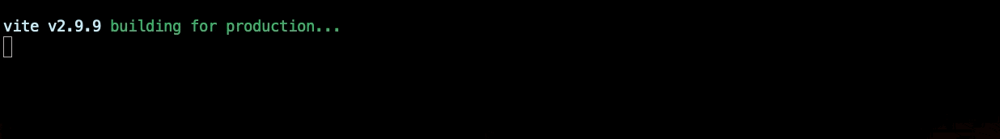

# vite-plugin-progress
Display with progress bar when building

[](https://npmjs.org/package/vite-plugin-progress)
[](https://www.npmjs.com/package/vite-plugin-progress)
[](https://npmjs.org/package/vite-plugin-progress)
[](https://github.com/vitejs/awesome-vite)

**English | [简体中文](https://github.com/jeddygong/vite-plugin-progress/blob/main/README.zh-CN.md)**
<p align="center">
  
</p>

## 📦 Install
```
npm i vite-plugin-progress -D 

# yarn 
yarn add vite-plugin-progress -D

# pnpm 
pnpm i vite-plugin-progress -D
```

## 🦄 Usage
Add `progress` plugin to `vite.config.js / vite.config.ts` and configure it:
```ts
// vite.config.js / vite.config.ts
import progress from 'vite-plugin-progress'

export default {
  plugins: [
    progress()
  ]
}
```

> Tip: During the first build, `transforms` and `chunks` are not displayed.


## Options
Accepts almost all of the same options as [node-progress](https://github.com/tj/node-progress#options).

- `format` the format of the progress bar
- `width` the displayed width of the progress bar defaulting to total
- `complete` completion character defaulting to "\u2588"
- `incomplete` incomplete character defaulting to "\u2591"
- `renderThrottle` minimum time between updates in milliseconds defaulting to 16
- `clear` option to clear the bar on completion defaulting to false
- `callback` optional function to call when the progress bar completes
- `stream` the output stream defaulting to stderr
- `head` head character defaulting to complete character
- `srcDir` the directory of the assets being built defaulting to "src"

The `format` option accepts the following tokens:

- `:bar` the progress bar itself
- `:current` current tick number
- `:total` total ticks
- `:elapsed` time elapsed in seconds
- `:percent` completion percentage
- `:eta` estimated completion time in seconds
- `:rate` rate of ticks per second


Use [picocolors](https://github.com/alexeyraspopov/picocolors) to sprinkle on a few colors.

## Configure options

```ts
// vite.config.js / vite.config.ts
import progress from 'vite-plugin-progress'

export default {
  plugins: [
    progress({
        format: 'building [:bar] :percent',
        total: 200,
        width: 60,
        complete: '=',
        incomplete: '',
    })
  ]
}
```

```ts
// vite.config.js / vite.config.ts
import progress from 'vite-plugin-progress'
import colors from 'picocolors'

export default {
  plugins: [
    progress({
        format:  `${colors.green(colors.bold('Bouilding'))} ${colors.cyan('[:bar]')} :percent`
    })
  ]
}
```

## Thanks

This project is inspired [progress-bar-webpack-plugin](https://github.com/clessg/progress-bar-webpack-plugin)

## License

[MIT](./LICENSE)
